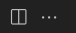
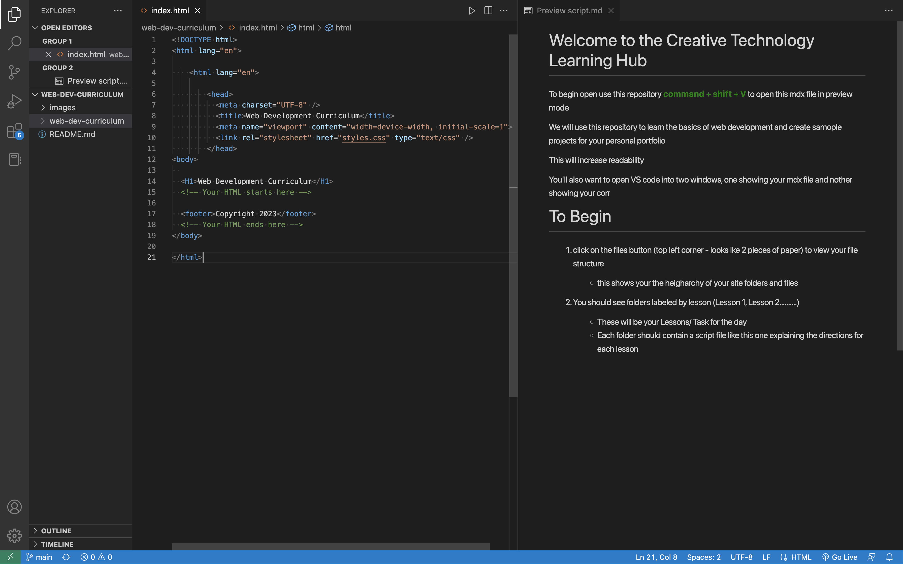

# Welcome to the Creative Technology Learning Hub

To begin open use this repository  **command** + **shift**  + **V**  to open this mdx file in preview mode

We will use this repository to learn the basics of web development and create samople projects for your personal portfolio

This will increase readability

You'll also want to make VScode display two files using the split editor button which looks like a box split in half

Your code editor should know look like this:

# To Begin

1. click on the files button (top left corner - looks lke 2 pieces of paper) to view your file structure

    - this shows your the heigharchy of your site folders and files

####

2. You should see folders labeled by lesson (Lesson 1, Lesson 2..........)

    - These will be your Lessons/ Task for the day
    - Each folder should contain a script file like this one explaining the directions for  each lesson
    - open the files as directed and begin...

